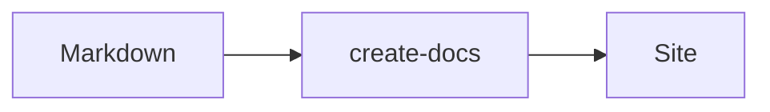

# Markdown Syntax

## Callouts

> [!NOTE]
> Useful information readers should know.

> [!TIP]
> A helpful suggestion.

> [!WARNING]
> Something to be careful about.

> [!DANGER]
> A destructive or risky action.

## Code groups

<code-group>

```ts [pnpm]
pnpm create @wrikka/docs my-docs
```

```ts [bun]
bun create @wrikka/docs my-docs
```

</code-group>

## Steps (tutorials)

<steps>

1. Install the package
2. Write markdown under `docs/`
3. Run the dev server

</steps>

## Live playground

<playground>

```html
<button style="padding:8px 16px;border-radius:8px;background:#7ee787;border:0">
	Hello docs
</button>
```

</playground>

## UI components

### Cards

<card-grid>

<card title="Getting Started" icon="i-mdi:rocket-launch" to="/docs/getting-started">
  Scaffold a site and mount the runtime.
</card>

<card title="Configuration" icon="i-mdi:cog" to="/docs/config">
  Site, features, i18n, versioning, and navigation config.
</card>

</card-grid>

### Tabs

<tabs>

<tab label="npm">

```bash
npm create @wrikka/docs my-docs
```

</tab>

<tab label="bun">

```bash
bun create @wrikka/docs my-docs
```

</tab>

</tabs>

### File tree

<file-tree>

<folder name="my-docs">
  <folder name="docs">
    <file name="index.md" />
    <file name="getting-started.md" />
  </folder>
  <file name="package.json" />
</folder>

</file-tree>

### Badges and keys

Use <badge text="new" type="primary" /> for status and <kbd>Ctrl + K</kbd> for keyboard shortcuts.

### Accordion

<accordion>

<item title="Why create-docs?">
  It combines VitePress-like docs, Scalar-like API references, and a pluggable data source in one SolidJS runtime.
</item>

<item title="Can I use a remote CMS?">
  Yes — implement `DocsDataSource` or use `createRemoteDataSource`.
</item>

</accordion>

### Timeline

<timeline>

<event date="2024-06-01" title="Initial release">
  First stable release of create-docs.
</event>

<event date="2025-01-15" title="API references">
  Added interactive API playground and OpenAPI support.
</event>

</timeline>

## Math

$$e^{i\pi} + 1 = 0$$

## Mermaid


